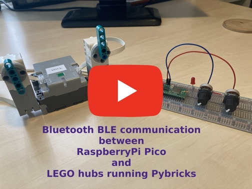

# Sending data between Raspberry Pi Pico and Pybricks LEGO hub

This is a short tutorial on how to send data between Raspberry Pi Pico and
LEGO hubs running Pybricks. It uses the same technique Pybricks uses for
[hub to hub communication](https://pybricks.com/projects/tutorials/wireless/hub-to-hub/broadcast/):

*When a Bluetooth BLE device is on but not yet connected to anything, it
typically broadcasts (advertises) some information about itself. This tells
you what it can do before you connect. By constantly changing what information
the hub advertises, we can broadcast small amounts of information to nearby
devices that are scanning for this information. This means that any number of
nearby hubs can receive the broadcasted message without having to set up a
connection. This can be quite convenient, but you can only broadcast small
amounts of information at once.*

We can do the same on a RPi Pico and thus we can send data to or read data
from LEGO hubs without connecting to them.

[](https://youtu.be/f9W5nRkdg3k?feature=shared "Youtube video")

## Pico as advertiser

For using Bluetooth BLE on the Pico you import the `bluetooth` module and
activate Bluetooth:

```
import bluetooth

ble = bluetooth.BLE()
ble.active(True)
```

Give the Pico the advertising role by using `gap.advertise()`:

```
ble.gap_advertise(interval_ms, adv_data=payload, resp_data=None, connectable=False)
```

Use for `interval_ms` the value `100`, because Pybricks requests an interval
of 100 ms.

You don't need response data, that's why `resp_data` is set to `None`.

Because a connection is not needed, `connectable` is set to `False`.

The hardest part (but not very difficult) is constructing the payload, the
data we want to sent to the hub(s). You can find thorough information
[here](https://github.com/pybricks/technical-info/blob/master/pybricks-ble-broadcast-observe.md).

For example, we want to send an integer representing the speed of a motor. This
value is a two byte integer. The payload data will be as follows
when `speed = 100`:

```
b'\x08\xFF\x97\x03\x01\x00\x62\x64\x00`
```

The first byte `\x08` is the number of bytes that follow (not including this one).
Add one to calculate the total length of the total payload. In our case the
first byte has the value 8 (`\x08`).

The second byte `\xFF` is indicating the manufacturing data in the next two bytes.
We set this to the LEGO company identifier `\x97\x03`.

Next comes the channel number. In Pybricks, all broadcasting data is assigned a
channel. This helps you tell data apart when multiple hubs are broadcasting at
the same time. For example, one hub might be broadcasting tilt sensor data on
channel 1 while another hub broadcasts measurements on channel 2. In our example
the value `\x01` is given to tell the data is broadcast on channel 1.

Finally we get to the point where the real data values are given, in our case
the speed value. It is possible to send just one data value or a tuple with
several data values. When there is just one data value we precede this with
`\x00`, the header that indicates there is only one data object. When we pass a
tuple with several values, this header can be omitted. You can see in our
example that we only pass one data object, because `\x00` is added to the
payload.

Each data object is presented by a header representing the type and size of
the data object. See the
[Pybricks documentation](https://github.com/pybricks/technical-info/blob/master/pybricks-ble-broadcast-observe.md)
on how to do this: type and length are packed in one byte (little endian).
In our example the data type is `INT` (type 3) and length
is two bytes. This gives us (see documentation) for the data header:

```
type = 3
length = 2
hdr = (type << 5) | (length & 0x1F)
```

Which makes the value for our header `98`. Packed in one byte this is `\x62`
(calculated as ```struct.pack('<b', 98)``` where ```'<b\'``` means one byte
value, little endian).

Finally we specify the data value, in our case `\x64\x00` for the value `100`
(two bytes, little endian).

In a real application the value for speed will change in time. When sending
the realtime value for speed, only the last to bytes of the payload in our
example above needs to be changed. All other values stay the same. You can see
this in the example code in this repository.

## Example code for Pico as advertiser

In this example we control two motors on a LEGO hub. On the Pico we use one
potentiometer to control the speed of the motor on port A. A second
potentiometer is used to let the motor on port B run to a given target angle.

Files:
 
- pico_advertising_target_speed.py
- hub_observing_target_speed.py

In both files is documented how to setup your Pico (with two potentiometers)
and hub (two motors).

Run the first file on your Pico and the second on your LEGO hub. This sample
assumes you are using a LEGO Technic Hub, but it also works on the other hubs
Pybricks can run on.

Data for speed regulation is broadcast on channel 1, data for target angle
is broadcast on channel 2. Change the speed of motor A and the target angle
of motor B by turning the potentiometers.

## Pico as observer

Instead of using the Pico as an advertiser, you can also send data from the
LEGO hub to the Pico. As an observer Pico receives broadcast data from many
devices, so the first step is to filter out broadcast messages send by LEGO
hubs. If it found a hub, than it can parse the data values it expects.

To activate the observer role for the Pico:

```
import bluetooth

ble = bluetooth.BLE()
ble.active(True)
ble.irq(bt_irq)

scanDuration_ms = 0   # 0 means indefenitely
interval_us = 100     # Interval 100ms is Pybricks condition
window_us = 100       # The same window as interval, means continuous scan
active = False        # Do not care for a reply for a scan from the transmitter

ble.gap_scan(scanDuration_ms, interval_us, window_us, active)
```

On the line `ble.irq(bt_irq)` you register a callback for BLE events. In
method `bt_irq` the events are handled. We are interested in event
`_IRQ_SCAN_RESULT`. When this event occurs we first check whether the
received advertising data is send from the LEGO hub. The third and fourth bytes
contain the manufacturer data. It's easy to check for the LEGO manufacturer id:

```
def check_lego_manufacturer_id(adv_data) -> bool:
    """ Check for LEGO manufacturer ID in advertisement data."""
    try:
        if adv_data[2] == 151 and adv_data[3] == 3:
            return True
        else:
            return False
    except IndexError:
        return False

```

If the advertisement data is indeed sent by the LEGO hub, the usefull data
values can be parsed. A very straightforward process. The Pybricks
documentation and the sample code described below will get you on your way.

### Example code for Pico as observer

In this example we control the brigthness of a LED connected to the Pico. The
brightness is adjusted by manually turning a LEGO motor connected to the hub
and sending the current rotation angle of the motor to the Pico. This value is
used to adjust the brightness of the LED.

Files:

- pico_observing_led.py
- ble_pybricks.py
- hub_adertising_led.py

In the source files is documented how to setup your Pico (with a LED connected
to pin GP15) and your hub (one motor connected to port A).

Upload the first two files to your Pico and start `pico_observing_led.py`.
File `ble_pybricks.py` contains some methods to parse the advertisement data.
Because these are put in a seperate file, you can easily re-use them in
other projects by adding `ble_pybricks.py` to your project.

When `pico_observing_led.py` is running on your pico, run
`hub_adertising_led.py` on your LEGO hub. Turn the motor manually and see
the brightness of the LED change.

## Links

- [Pybricks website](https://pybricks.com/)
- [Pybricks tutorial for hub to hub comunication](https://pybricks.com/projects/tutorials/wireless/hub-to-hub/broadcast/)
- [Pybricks documentation about BLE broadcasting and observing](https://github.com/pybricks/technical-info/blob/master/pybricks-ble-broadcast-observe.md)
- [MicroPython Bluetooth documentation](https://docs.micropython.org/en/latest/library/bluetooth.html)
- [Raspberry Pi Pico documentation](https://www.raspberrypi.com/documentation/microcontrollers/)
